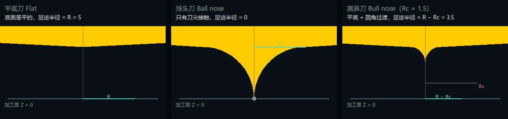

<p align="center">
  
</p>

# ToolpathLab

[](LICENSE)
[](https://www.python.org/)

ToolpathLab is a toolpath planning base: given a cutting tool and a regular machining region, it
generates toolpaths (raster or follow-periphery), shows the workpiece, the toolpath and the cutter in
a 3D window, and plays the whole process back at the programmed feed rate.

The backend is plain Python (numpy is the only dependency), the front-end is native ES modules with
a vendored three.js, and the desktop window is provided by Electron. Tools and regions are described
by parameters, and the parameter panel is generated from the backend's parameter declarations.


## Features

- **Tool**: flat, ball nose and bull nose end mills with diameter and length; the bull nose also takes a
  corner radius `Rc` (the control appears only for that kind). All three share one formula for the
  **footprint radius** - **radius minus corner radius**: `R` for flat, `0` for ball nose, `R - Rc` for
  bull nose; `Rc = 0` degenerates to a flat end mill and `Rc = R` to a ball nose. The footprint radius
  is what offsets the toolpath from the region contour.


- **Region**: three shapes centred at the origin
  - **square** (side) and **circle** (diameter): the machining surface is a horizontal plane with a
    **settable height** (relative to the Z = 0 datum, default 0, positive or negative). Toolpath Z,
    safe height and G-code all follow it; in the 3D view the solid sits at that height while the
    ground grid stays on the datum, so a raised region is obvious at a glance;
  - **ramp**: the XY projection is still a square (80 × 80 by default) while the machining surface
    rises from the outermost **+X edge** (Z = 0) towards -X at an adjustable angle (up to 80°) and an
    adjustable **Z cap** (the highest the slope may climb, 80 mm by default, range 1–1000): it turns
    into a flat top at the cap, so a smaller cap or a steeper angle widens the plateau, and a cap
    above the whole rise leaves no plateau at all. **Only the slope is machined by default** - the
    toolpath stops right at the crease and never runs onto the flat top (left for another operation);
    tick the region parameter "machine plateau" to cover both. (A height setting is not offered for
    the ramp yet.)
  - All three shapes also take a **part thickness** (how thick the body below the machining surface
    is, 20 mm by default). It is pure geometry: it only affects the workpiece solid in the 3D view
    and **never enters the toolpath** - make the stock thicker or thinner and the toolpath is
    identical.
- **Toolpaths**: two strategies
  - **raster** - parallel scan lines with two modes: **zigzag** (every other pass runs in the opposite
    direction and consecutive passes are linked) and **one-way** (all passes run in the same
    direction, retracting to the safe plane between passes or linking along the surface);
  - **follow-periphery** - constant offset loops that march inwards from the region contour until the
    region is cleared; the **cut order** is either inwards (contour first) or outwards (centre first)
    and the **winding** counter-clockwise or clockwise (seen from above), the same for every loop.
- **Cutting on a slope** (automatic whenever the machining surface is not horizontal, and switchable
  through the "entry" parameter): passes run **uphill**, the tool enters **along the surface** from
  outside the part instead of plunging into the slope, and one-way passes are **linked along the
  surface** instead of lifting to the safe plane every time.
- **Parameters**: stepover, pass direction, mode, entry, linking, cut order and feed rate; the region
  side adds side / diameter, machining height, part thickness, angle, Z cap and "machine plateau".
  Safe height, rapid feed, lead-in length and boundary handling are constants (see
  "Configuration constants").
- **3D view**: workpiece, region contour, toolpath (cut / link / rapid colour coded), cutter solid,
  traversed path, live shadows, and a **stock blank** you can generate / hide at any time (see below).
- **Playback**: time is parameterised by each move's own feed rate; play / pause, scrubbing, cutting
  length and estimated machining time.
- **Export**: NC program (G-code, G21 / G90 / G17 with G0 / G1 and F).
- **HTTP API**: catalog, planning and export endpoints for scripting and integration.

## Interface

The left side is the parameter panel; the right side holds the 3D view, statistics and the playback bar.

| Mouse | Action |
| --- | --- |
| Left drag | Orbit |
| Middle wheel | Zoom |
| Right drag | Pan |

- **Top bar buttons**: "Generate toolpath", "Generate stock", "Export NC", with a **top margin** input
  next to the stock button. **Generate stock** builds the blank for the current region - a **box for
  square and ramp, a vertical cylinder for circle** - with its **vertical faces flush against the
  region** (no XY margin) and its bottom flush with the workpiece; only the **top** carries the
  "top margin" (2 mm by default, editable 0–50), and changing it redraws the blank immediately without
  re-planning. It is drawn as a translucent violet volume with brighter edges, clearly apart from the
  workpiece and the paths; it follows region parameter changes and toggles away on a second click (the
  label switches between "Generate stock" and "Hide stock").
- **View toolbar** (top centre): fit / front / back / left / right / top / bottom; clicking the active
  direction again flips to the opposite side.
- **Appearance toggles** (top left): live shadows, white background, grid floor.
- **Playback bar** (bottom): play / pause (space bar works too), rewind, scrub, current time.
- **Statistics** (top right): region size, pass count, point count, cutting length, machining time.


The parameter panel is generated from `/api/catalog`: adding a region shape or a toolpath strategy
makes its controls appear in the interface without touching the front-end.

## Requirements

- Python 3.10+ and numpy (`pip install -r requirements.txt`);
- Node.js 18+ and Electron for the desktop window (`npm install`, about 200 MB);
- without Node.js the backend can still run in browser mode with the same features.

## Getting started

**Windows**: double click `start.bat`. It locates a usable Python (creating `.venv` and installing
numpy when needed), makes sure Electron is available (running `npm install` on first use) and opens
the desktop window.

**Manual**:

```bash
git clone https://github.com/large-su/toolpath-lab.git
cd toolpath-lab

pip install -r requirements.txt
npm install

npm start                 # desktop window (spawns the Python backend)
python -m toolpath_lab    # backend + browser only: http://127.0.0.1:8770/
```

Command line options: `--host`, `--port`, `--no-browser`.

## Usage

### As a library

```bash
python examples/headless_plan.py
```

The script puts the repository root on `sys.path` itself, so it runs without installing the package
and without setting `PYTHONPATH` (from any directory). The example plans a toolpath without any UI,
prints its statistics and writes an NC file:

```python
from toolpath_lab.core.region import build_region
from toolpath_lab.core.tool import Tool, ToolKind
from toolpath_lab.planning import run_plan

outcome = run_plan(
    planner_id="raster",
    tool=Tool(ToolKind.FLAT, diameter_mm=6.0, length_mm=30.0),
    region=build_region("square", {"side_mm": 80.0}),
    parameters={"mode": "zigzag", "stepover_mm": 6.0, "feed_mm_per_min": 800.0},
)
print(outcome.toolpath.statistics())
```

### HTTP API

| Endpoint | Purpose |
| --- | --- |
| `GET /api/health` | Health check and version |
| `GET /api/catalog` | Capabilities: region shapes, strategies, parameter declarations, defaults |
| `POST /api/plan` | Plan a toolpath; returns moves, statistics and the playback timeline |
| `POST /api/export/gcode` | Export the NC program |

```bash
curl http://127.0.0.1:8770/api/catalog

curl -X POST http://127.0.0.1:8770/api/plan \
  -H "Content-Type: application/json" \
  -d '{"tool":{"diameter_mm":6,"length_mm":30},
       "region":{"shape":"circle","parameters":{"diameter_mm":80}},
       "planner":{"id":"raster","parameters":{"mode":"one_way","stepover_mm":6}}}'
```

Invalid parameters return `400`; valid parameters that cannot be machined (for example a tool larger
than the region) return `422`, with the reason in the `error` field.

## Layout

```
toolpath_lab/core/        domain: parameter specs, tool, region, move/toolpath model
toolpath_lab/planning/    strategies: Planner base + registry, planar geometry, raster + follow-periphery
toolpath_lab/simulation/  feed-rate based time parameterisation
toolpath_lab/export/      G-code writer
toolpath_lab/server/      standard library HTTP API, request validation, static files
toolpath_lab/web/         front-end: native ES modules + vendored three.js, no build step
electron/                 desktop shell that spawns the backend and hosts the window
tools/                    frontend geometry self-check (node tools/check_frontend_geometry.mjs)
```

Dependencies point in one direction: `core` depends on nothing, `planning` / `simulation` /
`export` depend only on `core`, `server` assembles them, `web` talks HTTP and `electron` only owns
the window - so the planning code runs headless. See [docs/architecture.md](docs/architecture.md).

## Configuration constants

| Constant | Value | Location |
| --- | --- | --- |
| Safe height | 5 mm above the highest point of the machining surface the rapid travels over | `toolpath_lab/planning/base.py` |
| Rapid feed | 5000 mm/min | `toolpath_lab/planning/base.py` |
| Lead-in length | 5 mm (a slope entry cuts in from outside the part, along the surface) | `toolpath_lab/planning/base.py` |
| Boundary handling | inset the **machining area** by the tool footprint radius (slope-only ramps push the crease edge out by one footprint first) | `planning/raster.py`, `planning/follow_periphery.py` |
| Pass sampling | two end points on a flat region; one extra vertex at the ramp crease | `toolpath_lab/planning/base.py` |
| Loop linking | every loop runs in the same winding; loops are linked by a radial step-over at the seam, at feed, without retracting | `toolpath_lab/planning/follow_periphery.py` |
| Default ramp Z cap | 80 mm (a region parameter, 1–1000; the slope turns into the flat top there) | `toolpath_lab/core/region.py` |
| Default part thickness | 20 mm (a region parameter, 1–500); when a payload omits it the front-end falls back to 9% of the span, clamped to 4–24 mm | `toolpath_lab/core/region.py`, `toolpath_lab/web/js/viewport.js` |
| Default stock top margin | 2 mm (editable 0–50 in the top bar; vertical faces are flush with the region and the bottom with the workpiece) | `toolpath_lab/web/js/viewport.js` |

To expose them as adjustable parameters, see [docs/extending.md](docs/extending.md).

## Extending

- **A new strategy**: subclass `Planner`, declare its parameters, implement `plan()` and register it.
  [toolpath_lab/planning/follow_periphery.py](toolpath_lab/planning/follow_periphery.py)
  (follow-periphery) is a complete built-in implementation to copy the shape of;
  [examples/plugins/contour_planner.py](examples/plugins/contour_planner.py) is the same idea as a
  standalone plugin: copy it into `toolpath_lab/planning/` and import it once.
- **A new region shape**: implement `boundary()` returning a counter-clockwise polygon; clipping,
  follow-periphery loops and the 3D view adapt automatically. If the machining surface is not flat,
  add `height_at()` (Z for each (x, y)) and `surface_breaks()` (extra vertices at the creases) - the
  strategies stay untouched, which is exactly how the ramp is wired in.
- **A new export format**: add a pure function under `export/` and a branch in the HTTP router.

Full details: [docs/extending.md](docs/extending.md); conventions: [CONTRIBUTING.md](CONTRIBUTING.md).

## Tests

```bash
python -m unittest discover -s tests        # backend and library
node tools/check_frontend_geometry.mjs      # frontend geometry (path lift keeps Z, tool tip, workpiece normals)
```

## Design notes

The machining surface is described by the region itself: `height_at()` is identically zero for the flat
shapes and returns the truncated ramp height for the ramp, so toolpaths on flat and sloped surfaces
share one code path. The toolpath model covers the two most common machining styles - parallel scan
lines (raster) and loops offset from the contour (follow-periphery); the time axis accumulates each
move's own feed rate, and the 3D interaction follows the common CAD conventions (left drag orbits,
middle wheel zooms, right drag pans).

## License

[MIT](LICENSE)
