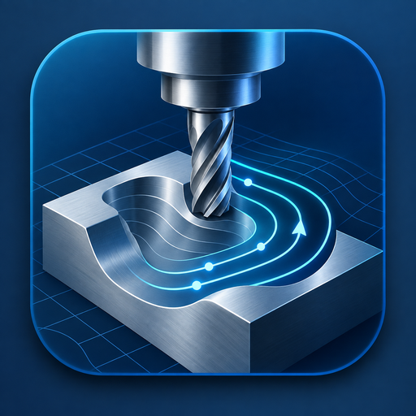
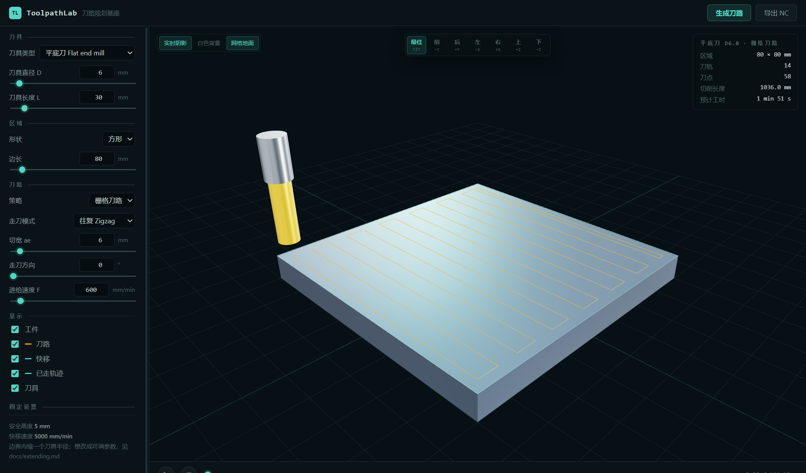
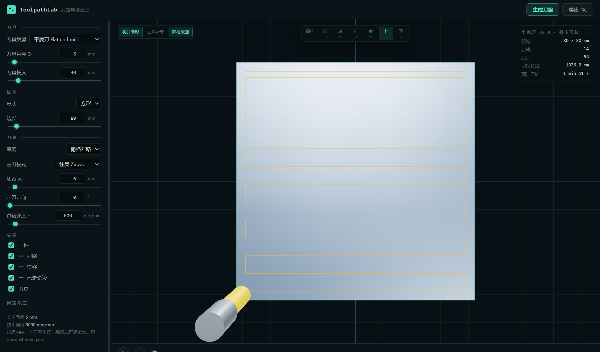

<p align="center">
  
</p>

# ToolpathLab · 刀路规划基座

[](LICENSE)
[](https://www.python.org/)

ToolpathLab 是一个刀路规划基座：给定一把刀具和一块规则形状的加工区域，生成栅格刀路，
在三维窗口中显示工件、刀路与刀具，并按进给速度播放整个加工过程。

后端是纯 Python（只依赖 numpy），前端是原生 ES 模块加 three.js，桌面窗口由 Electron 提供。
刀具与区域都用参数描述，参数面板根据后端的参数声明自动生成。



## 功能

- **刀具**：平底刀，可设置直径与长度。刀具在加工面上的足迹半径决定刀路相对区域轮廓的偏置量。
- **区域**：方形（边长）与圆形（直径），以原点为中心，加工面为 XY 平面。
- **刀路**：栅格刀路的两种模式
  - **往复 Zigzag**：奇数刀反向，相邻两刀在端头直接连过去；
  - **单向 One-way**：每刀同向，刀与刀之间抬刀到安全面再回到起点。
- **参数**：切宽、走刀方向角、进给速度。安全高度、快移速度、边界处理方式等为固定值，见[配置常量](#配置常量)。
- **三维视图**：工件实体、区域轮廓、刀路（切削 / 连接 / 快移分色）、刀具实体、已走轨迹、实时阴影。
- **播放**：按每段运动自己的进给速度做时间参数化，支持播放 / 暂停、拖动进度，并给出切削长度与预计工时。
- **导出**：NC 程序（G-code，G21 / G90 / G17 加 G0 / G1 带 F）。
- **HTTP 接口**：能力目录、规划、导出三个接口，便于脚本调用与集成。

## 界面

左侧是参数面板，右侧是三维视图、统计与播放条。

| 鼠标操作 | 功能 |
| --- | --- |
| 左键拖动 | 旋转视角 |
| 中键滚轮 | 缩放 |
| 右键拖动 | 平移 |

- **视图工具条**（顶部居中）：最佳 / 前 / 后 / 左 / 右 / 上 / 下；再次点击当前方向会切换到对面。
- **外观开关**（左上角）：实时阴影、白色背景、网格地面。
- **播放条**（底部）：播放 / 暂停（空格键同样有效）、回到起点、拖动进度、当前时间。
- **统计面板**（右上角）：区域尺寸、刀轨条数、刀点数量、切削长度、预计工时。



参数面板由后端 `/api/catalog` 返回的参数声明生成：新增区域形状或刀路策略后，
界面上会自动出现对应的控件，不需要修改前端代码。

## 环境要求

- Python 3.10 及以上，numpy（`pip install -r requirements.txt`）；
- 桌面窗口需要 Node.js 18 及以上与 Electron（`npm install` 自动获取，约 200 MB）；
- 没有 Node.js 时仍可使用浏览器方式运行，功能一致。

## 安装与启动

**Windows**：双击 `start.bat`。脚本会查找可用的 Python（必要时创建 `.venv` 并安装 numpy）、
确认 Electron 是否就绪（首次会执行 `npm install`），然后打开桌面窗口。

**手动启动**：

```bash
git clone https://github.com/large-su/toolpath-lab.git
cd toolpath-lab

pip install -r requirements.txt
npm install

npm start                 # 桌面窗口（自动拉起 Python 后端）
python -m toolpath_lab    # 只用后端 + 浏览器：http://127.0.0.1:8770/
```

命令行参数：`--host`、`--port`、`--no-browser`。

## 使用

### 脚本调用

```bash
python examples/headless_plan.py
```

该示例不使用界面，直接生成一条刀路、打印统计信息并导出 NC 文件，
可以当作把 ToolpathLab 当作库使用的起点：

```python
from toolpath_lab.core.region import build_region
from toolpath_lab.core.tool import Tool, ToolKind
from toolpath_lab.planning import run_plan

outcome = run_plan(
    planner_id="raster",
    tool=Tool(ToolKind.FLAT, diameter_mm=6.0, length_mm=30.0),
    region=build_region("square", {"side_mm": 80.0}),
    parameters={"mode": "zigzag", "stepover_mm": 6.0, "feed_mm_per_min": 800.0},
)
print(outcome.toolpath.statistics())
```

### HTTP 接口

| 接口 | 说明 |
| --- | --- |
| `GET /api/health` | 健康检查与版本号 |
| `GET /api/catalog` | 能力目录：区域形状、刀路策略、参数声明、默认值与固定值 |
| `POST /api/plan` | 生成刀路，返回刀路运动段、统计与播放时间轴 |
| `POST /api/export/gcode` | 导出 NC 程序 |

```bash
curl http://127.0.0.1:8770/api/catalog

curl -X POST http://127.0.0.1:8770/api/plan \
  -H "Content-Type: application/json" \
  -d '{"tool":{"diameter_mm":6,"length_mm":30},
       "region":{"shape":"circle","parameters":{"diameter_mm":80}},
       "planner":{"id":"raster","parameters":{"mode":"one_way","stepover_mm":6}}}'

curl -X POST http://127.0.0.1:8770/api/export/gcode \
  -H "Content-Type: application/json" -d '{}' -o toolpath.nc
```

参数非法返回 `400`；参数合法但几何上无法加工（例如刀具直径大于区域尺寸）返回 `422`，
响应体中的 `error` 字段给出具体原因。

## 项目结构

```
toolpath_lab/
  core/        领域层：参数声明、刀具、区域、刀路与运动段模型
  planning/    策略层：Planner 基类与注册表、平面多边形几何、栅格刀路
  simulation/  时间层：按进给速度把刀路参数化为时间轴
  export/      G-code 导出
  server/      标准库 HTTP 服务：接口路由、请求校验、能力目录、静态文件
  web/         前端：原生 ES 模块 + three.js（随仓库提供，无打包步骤）
electron/      桌面壳：拉起 Python 后端并承载窗口
examples/      命令行示例与示例插件
tests/         单元测试
docs/          架构与扩展文档
```

依赖方向是单向的：`core` 不依赖其它层，`planning` / `simulation` / `export` 只依赖 `core`，
`server` 负责组装，`web` 只通过 HTTP 与后端通信，`electron` 只负责窗口。
因此刀路算法可以脱离界面单独运行。详见 [docs/architecture.md](docs/architecture.md)。

## 配置常量

以下数值定义在代码中，不在界面上暴露：

| 常量 | 值 | 位置 |
| --- | --- | --- |
| 安全高度 | 5 mm | `toolpath_lab/planning/base.py` |
| 快移速度 | 5000 mm/min | `toolpath_lab/planning/base.py` |
| 边界处理 | 刀路相对区域轮廓内缩一个刀具足迹半径 | `toolpath_lab/planning/raster.py` |
| 每刀采样 | 两个端点（加工面为平面） | `toolpath_lab/planning/raster.py` |

把它们改成可在界面上调整的参数，做法见 [docs/extending.md](docs/extending.md)。

## 扩展

- **新增刀路策略**：继承 `Planner`，声明参数并实现 `plan()`，然后注册。
  [examples/plugins/contour_planner.py](examples/plugins/contour_planner.py) 是一个可直接使用的
  环切（等距轮廓）实现，复制到 `toolpath_lab/planning/` 并在 `__init__.py` 中导入一行即可启用。
- **新增区域形状**：实现一个返回逆时针边界多边形的 `boundary()`，栅格刀路与三维显示会自动适配。
- **新增导出格式**：在 `export/` 中写一个纯函数，并在 HTTP 路由中加一个分支。
- 完整说明见 [docs/extending.md](docs/extending.md)，开发约定见 [CONTRIBUTING.md](CONTRIBUTING.md)。

## 测试

```bash
python -m unittest discover -s tests
```

覆盖几何裁剪、刀路模式与安全高度、时间参数化、G-code 导出、HTTP 接口与静态资源。

## 设计说明

刀路模型采用机械加工中常见的平行扫描线形式，时间轴按各段运动的进给速度累加，
三维交互沿用通用的三维 CAD 操作习惯（左键旋转、中键缩放、右键平移）。

## 许可

[MIT](LICENSE)
