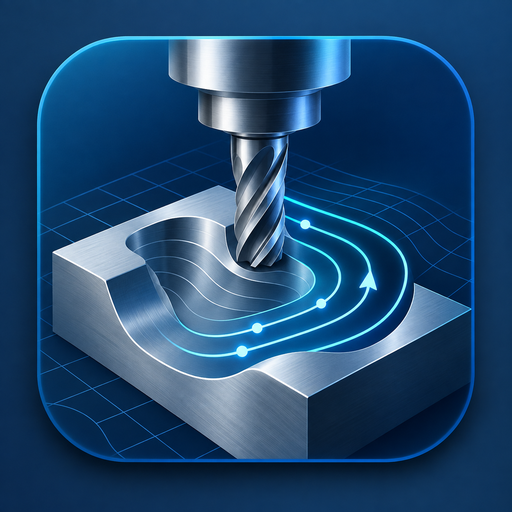
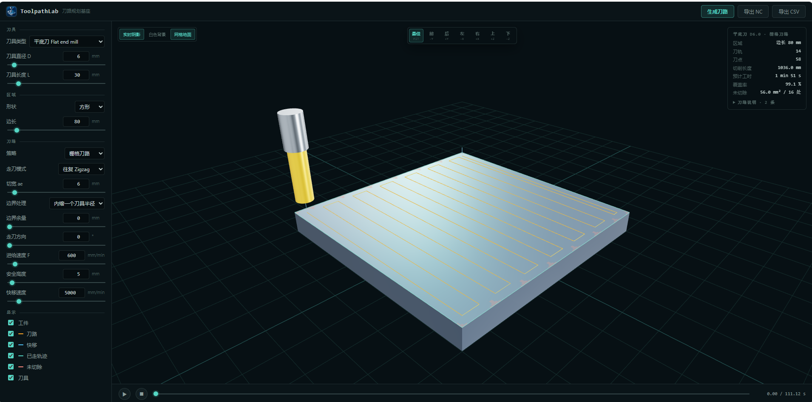
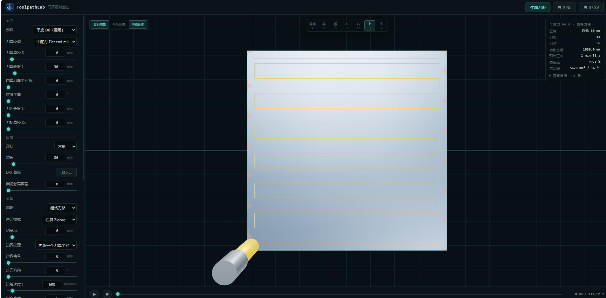

<p align="center">
  
</p>

# ToolpathLab · 刀路规划基座

[](LICENSE)
[](https://www.python.org/)

ToolpathLab 是一个刀路规划基座：给定一把刀具和一块规则形状的加工区域，生成栅格刀路，
在三维窗口中显示工件、刀路与刀具，并按进给速度播放整个加工过程。

后端是纯 Python（只依赖 numpy），前端是原生 ES 模块加 three.js，桌面窗口由 Electron 提供。
刀具与区域都用参数描述，参数面板根据后端的参数声明自动生成。



## 功能

- **刀具**：平底刀，可设置直径与长度。刀具在加工面上的足迹半径决定刀路相对区域轮廓的偏置量。
- **区域**：方形（边长）、矩形（宽 × 高）、圆形（直径）、椭圆（长 / 短半轴）、
  U 形（外宽 / 外高 / 壁厚）、哑铃形（两端方头 + 细颈）、三角形（底边 × 高，顶角可调尖），
  都以原点为中心，加工面为 XY 平面。
- **刀路**：
  - **往复 Zigzag**：奇数刀反向，相邻两刀在端头直接连过去；
  - **单向 One-way**：每刀同向，刀与刀之间抬刀到安全面再回到起点；
  - **环切 Contour**：从区域轮廓逐圈向内偏置（等距轮廓），相邻环方向可切换（交替 / 全顺铣 /
    全逆铣）；凹形状的细颈被偏置吃掉后一层会分裂成多条环，互不相连的环之间自动抬刀快移，
    套在里面的环之间直接过渡。
  - **自适应环切 Adaptive**：环切 + 覆盖率闭环。用请求的切宽算一遍、量一下覆盖率，没到
    「目标覆盖率」就按「收紧系数」收窄重算（默认最多 3 轮，切宽收到「切宽下限」为止），
    最后返回覆盖率**最好**的那一次；同时守「工时上限」——收窄切宽靠的是多走几圈，太贵的那一轮
    不采用。到不了目标时提醒"要达标得多花多少时间"或"收到多少就不再提升"（后者往往是刀具
    几何的极限：圆刀切不到尖角）。
- **参数**：切宽、走刀方向角、进给速度、安全高度、快移速度、**拐角减速**；栅格策略另有
  **边界处理方式**与**边界余量**。控件由后端的参数声明自动生成，见[参数与固定值](#参数与固定值)。
- **拐角减速**：切削段转角超过「拐角减速起始角」时，进给按转角线性降到「拐角最低进给」
  （180° 折返处降到该比例）。环切的多边形角、小半径环的折线角都会被降速，圆滑曲线不受影响；
  刀路被切成若干段等进给的移动，几何与刀轨数不变，只有进给、预计工时与播放速度会变。
  默认关闭（起始角 0°），打开方式见[参数与固定值](#参数与固定值)。
- **三维视图**：工件实体、区域轮廓、刀路（切削 / 连接 / 快移分色）、刀具实体、已走轨迹、实时阴影。
- **播放**：按每段运动自己的进给速度做时间参数化，支持播放 / 暂停、拖动进度，并给出切削长度与预计工时。
- **导出**：NC 程序（G-code，G21 / G90 / G17 加 G0 / G1 带 F）与 **CSV 点表**（一个刀点一行，
  可直接丢进 Excel / pandas）；界面上对应「导出 NC」与「导出 CSV」两个按钮，接口见下表。
- **分析**：**覆盖率**——用网格比对"刀具扫过的面积"与区域面积，给出覆盖率、未切除面积与
  未切除连通块的位置，并在三维里用警示色**叠出未切除的区域**（左侧「显示」里可关掉）；
  漏切较多时（默认超过 2%）随响应给出提醒。
- **闭环**：**自适应环切**策略——先用请求的切宽算一遍、量一下覆盖率，没到目标就自动收窄
  重算（默认最多 3 轮），同时守住工时上限，返回覆盖率与工时都合适的那一次；到不了目标就
  如实说明"要达标得多花多少时间"或"收到多少就不再提升"。每一轮的切宽、覆盖率、环数、
  切削长度与工时都写在「刀路说明」里，就是一条性价比曲线。
- **HTTP 接口**：能力目录、规划、导出三个接口，便于脚本调用与集成。

## 界面

左侧是参数面板，右侧是三维视图、统计与播放条。

| 鼠标操作 | 功能 |
| --- | --- |
| 左键拖动 | 旋转视角 |
| 中键滚轮 | 缩放 |
| 右键拖动 | 平移 |

- **视图工具条**（顶部居中）：最佳 / 前 / 后 / 左 / 右 / 上 / 下；再次点击当前方向会切换到对面。
- **外观开关**（左上角）：实时阴影、白色背景、网格地面。
- **显示开关**（参数面板底部）：工件 / 刀路 / 快移 / 已走轨迹 / **未切除** / 刀具逐项开关；
  其中"未切除"是覆盖率分析标出来的漏切区域（半透明警示色叠在工件上）。
- **播放条**（底部）：播放 / 暂停（空格键同样有效）、回到起点、拖动进度、当前时间。
- **统计面板**（右上角）：区域尺寸、刀轨条数、刀点数量、切削长度、预计工时、覆盖率与未切除面积；
  底下还有可展开的**「刀路说明」**（后端策略写的过程信息：环数/层数、环绕向、自适应各轮的
  性价比曲线等），默认收起。



参数面板由后端 `/api/catalog` 返回的参数声明生成：新增区域形状或刀路策略后，
界面上会自动出现对应的控件，不需要修改前端代码。

## 环境要求

- Python 3.10 及以上，numpy（`pip install -r requirements.txt`）；
- 桌面窗口需要 Node.js 18 及以上与 Electron（`npm install` 自动获取，约 200 MB）；
- 没有 Node.js 时仍可使用浏览器方式运行，功能一致。

## 安装与启动

**Windows**：双击 `start.bat`。脚本会查找可用的 Python（必要时创建 `.venv` 并安装 numpy）、
确认 Electron 是否就绪（首次会执行 `npm install`），然后打开桌面窗口。

**手动启动**：

```bash
git clone https://github.com/large-su/toolpath-lab.git
cd toolpath-lab

pip install -r requirements.txt
npm install

npm start                 # 桌面窗口（自动拉起 Python 后端）
python -m toolpath_lab    # 只用后端 + 浏览器：http://127.0.0.1:8770/
```

命令行参数：`--host`、`--port`、`--no-browser`。

## 使用

### 脚本调用

```bash
python examples/headless_plan.py
```

该示例不使用界面，直接生成一条刀路、打印统计信息并导出 NC 文件，
可以当作把 ToolpathLab 当作库使用的起点：

```python
from toolpath_lab.core.region import build_region
from toolpath_lab.core.tool import Tool, ToolKind
from toolpath_lab.planning import run_plan

outcome = run_plan(
    planner_id="raster",
    tool=Tool(ToolKind.FLAT, diameter_mm=6.0, length_mm=30.0),
    region=build_region("square", {"side_mm": 80.0}),
    parameters={"mode": "zigzag", "stepover_mm": 6.0, "feed_mm_per_min": 800.0},
)
print(outcome.toolpath.statistics())
```

### HTTP 接口

| 接口 | 说明 |
| --- | --- |
| `GET /api/health` | 健康检查与版本号 |
| `GET /api/catalog` | 能力目录：区域形状、刀路策略、参数声明与默认值 |
| `POST /api/plan` | 生成刀路，返回刀路运动段、统计、覆盖率与播放时间轴 |
| `POST /api/export/gcode` | 导出 NC 程序 |
| `POST /api/export/csv` | 导出 CSV 点表（`move_index,pass_index,kind,feed_mm_per_min,point_index,x_mm,y_mm,z_mm`，非切削段 `pass_index` 为 -1） |

```bash
curl http://127.0.0.1:8770/api/catalog

curl -X POST http://127.0.0.1:8770/api/plan \
  -H "Content-Type: application/json" \
  -d '{"tool":{"diameter_mm":6,"length_mm":30},
       "region":{"shape":"circle","parameters":{"diameter_mm":80}},
       "planner":{"id":"raster","parameters":{"mode":"one_way","stepover_mm":6}}}'

curl -X POST http://127.0.0.1:8770/api/export/gcode \
  -H "Content-Type: application/json" -d '{}' -o toolpath.nc

curl -X POST http://127.0.0.1:8770/api/export/csv \
  -H "Content-Type: application/json" -d '{}' -o toolpath.csv
```

参数非法返回 `400`；参数合法但几何上无法加工（例如刀具直径大于区域尺寸）返回 `422`，
响应体中的 `error` 字段给出具体原因。

## 项目结构

```
toolpath_lab/
  core/        领域层：参数声明、刀具、区域、刀路与运动段模型
  planning/    策略层：Planner 基类与注册表、平面多边形几何、栅格刀路、环切刀路、覆盖率分析
  simulation/  时间层：按进给速度把刀路参数化为时间轴
  export/      G-code 导出
  server/      标准库 HTTP 服务：接口路由、请求校验、能力目录、静态文件
  web/         前端：原生 ES 模块 + three.js（随仓库提供，无打包步骤）
electron/      桌面壳：拉起 Python 后端并承载窗口
examples/      命令行示例与示例插件
tests/         单元测试
docs/          架构与扩展文档
```

依赖方向是单向的：`core` 不依赖其它层，`planning` / `simulation` / `export` 只依赖 `core`，
`server` 负责组装，`web` 只通过 HTTP 与后端通信，`electron` 只负责窗口。
因此刀路算法可以脱离界面单独运行。详见 [docs/architecture.md](docs/architecture.md)。

## 参数与固定值

**可在界面上调整的参数**（接口里是同名的请求字段）：

| 参数 | 键 | 默认值 | 范围 | 作用范围 |
| --- | --- | --- | --- | --- |
| 安全高度 | `safe_height_mm` | 5 mm | 0–200 | 所有策略（快移时抬到 Z = 0 之上多高；0 = 不抬刀） |
| 快移速度 | `rapid_feed_mm_per_min` | 5000 mm/min | 100–50000 | 所有策略（抬刀 / 横移 / 下刀，计入预计工时） |
| 拐角减速起始角 | `corner_angle_deg` | 0°（关闭） | 0–180 | 所有策略（切削段转角超过它开始降速；0 = 关闭） |
| 拐角最低进给 | `corner_feed_ratio` | 0.35 × | 0.05–1 | 所有策略（180° 折返处降到编程进给的这个比例） |
| 边界处理 | `boundary_mode` | 内缩一个刀具半径 | inset / none | 栅格策略（`none` = 刀心走在轮廓线上，会切出区域一圈） |
| 边界余量 | `stock_allowance_mm` | 0 mm | 0–20 | 栅格策略（在轮廓内侧留一圈余量，`none` 时不生效） |
| 环绕向 | `ring_direction` | 交替 | alternate / climb / conventional | 环切策略（顺铣 / 逆铣，约定见下） |
| 目标覆盖率 | `coverage_target` | 99.5 % | 50–100 | 自适应环切（低于它就收窄切宽重算） |
| 工时上限 | `max_time_ratio` | 2 × | 1–10 | 自适应环切（收紧后工时不超过首轮的这么多倍，超出就不采用那一轮） |
| 最多重算 | `max_rounds` | 3 | 0–8 | 自适应环切（再收紧几次；每轮都会多花一点时间） |
| 收紧系数 | `stepover_factor` | 0.7 | 0.3–0.95 | 自适应环切（每轮把切宽乘以它） |
| 切宽下限 | `min_stepover_mm` | 1 mm | 0.2–20 | 自适应环切（再小也不收，否则环数暴涨） |

前四项（安全高度、快移速度、拐角减速起始角、拐角最低进给）声明在
`toolpath_lab/planning/base.py` 的 `MOTION_PARAMETERS`，由各策略并进自己的 `ParameterSet`，
所以新增策略只要 `+ MOTION_PARAMETERS` 就自动获得；边界两项是栅格策略特有的，环绕向是环切
特有的，最后五项是自适应环切特有的（它在环切参数集上再加这五项）。

**顺铣 / 逆铣怎么算的**：这里按**几何绕向**标注——环切从外往内走，未加工的材料始终在环的
**内侧**，所以在"主轴 M03（从上往下看顺时针）+ 右手刀具"的前提下，**逆时针 = 顺铣**
（接触点的刀刃运动方向与进给同向），顺时针 = 逆铣。换成 M04，或者加工的是外轮廓（材料在刀路
外侧），顺铣与逆铣就要对调。栅格策略没有这个参数：一刀的两侧一侧顺、一侧逆，没有单一答案，
往复本身就是在交替。

**仍然是固定的设计选择**：

| 事项 | 值 | 位置 |
| --- | --- | --- |
| 每刀采样 | 两个端点（加工面是平面，所以一刀两个点） | `toolpath_lab/planning/raster.py` |
| 圆形离散 | 180 段折线逼近（圆与椭圆共用，见 `CURVE_SEGMENTS`） | `toolpath_lab/core/region.py` |
| 工件建模 | 按区域边界多边形挤出，上表面在 Z = 0 | `toolpath_lab/web/js/viewport.js` |
| 环切边界 | 第一环永远内缩一个刀具足迹半径（偏置几何只支持向内） | `toolpath_lab/planning/contour.py` |
| 刀路显示 | 抬高 0.05 mm 画在工件上表面之上，避免 z-fighting | `toolpath_lab/web/js/viewport.js` |

再加一个参数的完整做法（声明 → 读取 → 补测试 → 记 CHANGELOG）见 [docs/extending.md](docs/extending.md) §3。

## 扩展

- **新增刀路策略**：继承 `Planner`，声明参数并实现 `plan()`，然后在 `planning/__init__.py`
  里导入一行即可注册。内置的 [contour.py](toolpath_lab/planning/contour.py)（环切）与
  [examples/plugins/contour_planner.py](examples/plugins/contour_planner.py) 放在一起看，
  就是"一个策略需要写什么"的完整例子。
- **新增区域形状**：实现一个返回逆时针边界多边形的 `boundary()`，栅格刀路、环切与三维工件都会
  自动适配——工件就是按这条边界挤出的，环切也靠通用的偏置几何（细颈被吃掉时会分裂成多条环）。
  所以矩形、椭圆、U 形、哑铃形（甚至凹多边形）都没有改刀路或前端代码。
- **新增导出格式**：在 `export/` 中写一个纯函数，并在 HTTP 路由中加一个分支——
  `gcode.py` 与 `csv.py` 就是现成的两个例子。
- 完整说明见 [docs/extending.md](docs/extending.md)，开发约定见 [CONTRIBUTING.md](CONTRIBUTING.md)。

## 测试

```bash
python -m unittest discover -s tests
```

覆盖几何裁剪与等距偏置、刀路模式与安全高度、时间参数化、G-code 导出、HTTP 接口与静态资源。

## 设计说明

刀路模型采用机械加工中常见的平行扫描线（栅格）与等距轮廓（环切）两种形式，时间轴按各段运动的
进给速度累加，三维交互沿用通用的三维 CAD 操作习惯（左键旋转、中键缩放、右键平移）。

## 许可

[MIT](LICENSE)
