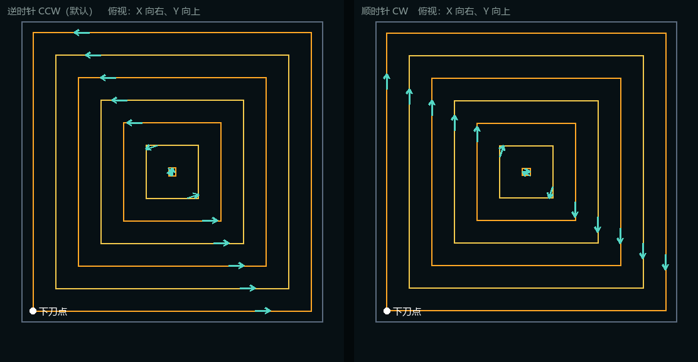
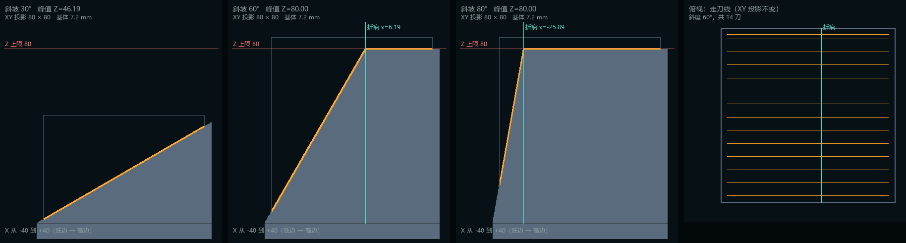
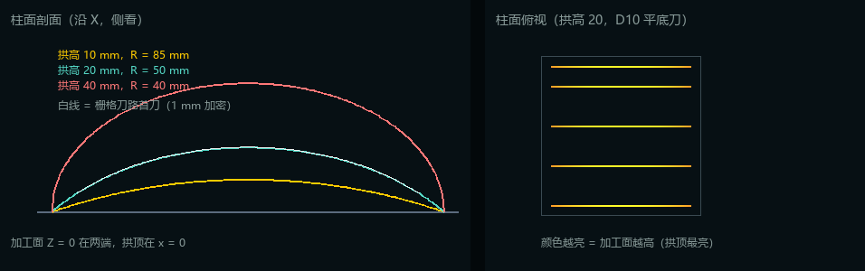

# 架构

## 分层与依赖方向

```
   electron/main.mjs           独立窗口（只负责拉起后端并装窗口）
        │  HTTP / JSON
      server ─────────┐
        │             │
   ┌────┴────┐     export
   │         │        │
planning ── simulation ┘
   │            │
   └──► core ◄──┘
        ▲
        │ 静态文件
      web（原生 ES 模块 + three.js）
```

依赖只有一个方向。`core` 不认识任何其它层，`planning` / `simulation` / `export` 只依赖 `core`，
`server` 组装全部，`web` 只通过 HTTP 说话，`electron` 只负责窗口。由此得到三个好处：

- 刀路算法可以脱离界面单独跑（`examples/headless_plan.py`）；
- 换传输层（CLI、gRPC、ROS 节点）不需要动算法；
- 把 `core` + `planning` 搬进别的项目不会拖入框架依赖。

## 各层职责

### core —— 领域层

| 模块 | 职责 |
| --- | --- |
| `parameters.py` | `ParameterSpec` / `ParameterSet`：声明式参数（类型、范围、默认值、单位、中文标签、显隐条件、选项的 disabled），同时驱动界面、校验与文档 |
| `tool.py` | 刀具：类型（平底 / 球头 / 圆鼻）、直径、长度、刀尖圆角，以及**足迹半径 = 半径 − 刀尖圆角半径**（刀路相对轮廓的偏置量） |
| `region.py` | 区域形状：方形、圆形、斜坡与柱面；统一输出逆时针边界多边形（XY 投影），并用 `height_at()` 描述加工面——平面恒为 0，斜坡是被截到 80 mm 的斜面，柱面是沿 Y 轴扫掠的圆弧；曲面再用 `surface_sample_step_mm` 声明加密步长 |
| `path.py` | `Move`（切削/连接/快移 + 进给）与 `Toolpath`（统计、载荷） |
| `registry.py` | 通用能力注册表（区域形状、策略共用） |
| `payload.py` | 请求字典 → 领域对象的拆解工具 |

### planning —— 策略层

- `base.py`：`PlanningContext`（刀具 + 区域 + 参数）与 `Planner` 基类；固定的安全高度与快移速度也在这里。
  把平面点抬到加工面上（含折痕补点）也在 `to_positions()` 里做，所以策略不必关心加工面是平的还是斜的；
- `geometry2d.py`：平面几何——`scanline_intervals`（直线与多边形求交、偶奇配对）与多边形规范化，
  再加上 `offset_polygon`（等距偏置）与 `resample_ring`（等弧长重采样）；
- `raster.py`：平行扫描线，往复与单向两种模式；
- `follow_periphery.py`：沿轮廓逐圈等距偏置，直到区域切满，可选向内 / 向外走刀。

### simulation —— 时间层

`build_timeline` 把每段运动按自己的进给速度换算成时间（t = 弧长 / 进给），在弧长上重采样并限制
总采样数（默认 4000），同时保留每段边界，所以播放不会跨段插值。载荷里 `times` / `positions`
是逐采样数组，`kind_runs` / `move_runs` 是游程编码。

### export / server / web / electron

- `export/gcode.py`：G21 / G90 / G17 + G0 / G1 带 F 的最常见 ISO 子集；
- `server`：标准库 `ThreadingHTTPServer`。`schema.py` 是唯一的请求校验入口，`service.py` 组装响应，
  `catalog.py` 生成能力目录，`app.py` 只做路由与错误码映射（400 参数错误 / 422 几何不可行 / 404 / 405）；
  静态文件只从 `web/` 提供并做了路径穿越防护；
- `web`：`panel.js` 依据目录生成控件，`viewport.js` 负责 three.js 场景与相机，`playback.js` 是纯逻辑的
  时间插值器，`main.js` 负责串联；
- `electron/main.mjs`：挑一个空闲端口 → 拉起 `python -m toolpath_lab` → 轮询 `/api/health` →
  装进原生窗口；关窗时结束后端。前端是普通静态文件，所以不需要打包器。

## 关键算法

### 栅格刀路

1. 把区域轮廓旋转到"走刀坐标系"：u 沿走刀方向，v 垂直于它；
2. 在 v 方向按切宽布刀，两端各内缩一个刀具足迹半径（保证刀不会切出区域）；
3. 每条刀线用 `scanline_intervals` 求交，得到它在区域内部的区间（方形是整条，圆形是一条弦，
   凹形状可以是多段）；
4. 区间两端就是这一刀的起点和终点——一刀两个点，因为加工面是平面；
5. 往复模式奇数刀反向、刀间直接连过去；单向模式每刀同向、刀间抬到安全面再回来；
   首尾补"下刀"和"抬刀"。

### 跟随周边

1. 把区域轮廓按刀具足迹半径内缩，得到第一环——刀正好贴住轮廓；
2. 每环再往里推进一个切宽，用 `offset_polygon` 求新的等距轮廓（凸角斜接、凹角补圆弧），
   所以方形的环是同心方、圆形的环是同心圆；
3. 偏置结果退化为空（面积过小，或自交顶点被"到原边界距离"过滤光）时结束——此时区域已经切满；
4. 每环按采样步长离散成刀点，**所有环按同一个绕向**走（俯视逆时针或顺时针），环间沿同一条缝
   径向过渡一个切宽、用切削进给连过去（不抬刀）；
   "向内 / 向外"只是把环序正放或倒放，两种顺序的刀轨完全相同，区别只是先从轮廓还是先从料心下刀。



### 斜面与曲面（加工面不是平面）

区域用 `height_at(x, y)` 描述加工面，`PlanningContext.to_positions()` 据此给折线取 Z，于是栅格与跟随
周边都不需要知道自己走的是平面、斜面还是曲面，G-code、时间轴与统计也自然带上真实 Z。补点分两种：

- **分片平面**（斜坡）：`surface_breaks()` 给出折角位置（"斜面转平顶"的折痕），
  在那里补一个点就足够精确，所以平面仍是"一刀两个点"；
- **曲面**（柱面）：折角表达不了弯曲，区域用 `surface_sample_step_mm`（柱面取 1 mm）声明采样步长，
  `to_positions()` 沿折线按它加密——1 mm 步长在半径 40 mm 量级的弧上弦高误差约 0.03 mm。

抬刀与横移的安全面也相对加工面，而且按**整段路径经过的最高点**算：柱面的拱顶通常落在刀路中间，
只看两端的横移会从拱顶穿过去。区域能用 `surface_max_along()` 解析给出最高点就解析（柱面只在
端点或 x = 0 处取到），给不出时才按采样步长采样——采样会漏掉光滑曲面的顶点。

三维显示分两条路：顶面是分片平面的，后端下发**共面的凸分片**（斜坡是"斜段 + 平顶"两片），前端扇形
三角化；顶面是曲面的，后端下发**一条母线**（柱面是 80 个点的圆弧轮廓），前端沿 Y 轴扫掠成曲面。
两条路都复用同一套侧壁（按三维轮廓挤出）与底面（扇形三角化），前端依旧不需要懂加工面的数学。





### 时间参数化

每段运动携带自己的进给速度，累计时间就是各段"弧长 / 进给"之和，因此快移段与切削段对"预计工时"
的贡献不同。播放时在时间轴上二分查找 + 线性插值；采样下标同时用于"已走轨迹"的绘制范围
（`setDrawRange`），不需要额外几何。

## 想动手改的时候

- 想加**参数**：在对应能力的 `ParameterSet` 里加一行 `spec(...)`，界面与校验自动跟上；
- 想加**形状**：写一个 `boundary()` 返回逆时针多边形；
- 想加**策略**：继承 `Planner` 并注册，见 extending.md；
- 想加**加工面**：实现区域的 `height_at()` 与 `surface_breaks()`（斜坡就是这么接进来的），策略不用动；
  再给 `surface_patches()` 一个实现，前端就能拼出对应的工件实体；
- 想加**真正的三维曲面**：在高度场的基础上给 `Move` 加刀轴字段，并把折线按采样步长离散；
- 想加**导出格式**：在 `export/` 写一个纯函数，在 `server/app.py` 加一个分支。
